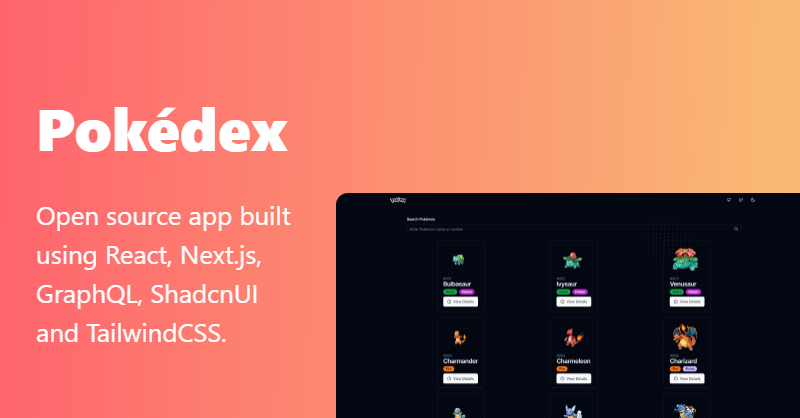

<h1 align="center">Pokédex</h1>
<p align="center">
  
  <a href="https://www.linkedin.com/in/fellipeutaka/">
    
  </a>
  <a href="https://github.com/fellipeutaka/pokedex/commits/main">
    
  </a>
  
  <a href="https://github.com/fellipeutaka/pokedex/stargazers">
    
  </a>
</p>

<p align="center">
  <a href="#-project">Project</a> |
  <a href="#-technologies">Technologies</a> |
  <a href="#ℹ%EF%B8%8F-how-to-use">How to use</a> |
  <a href="#-how-to-contribute">How to contribute</a> |
  <a href="#-license">License</a> |
  <a href="https://pokedex-fellipeutaka.vercel.app">Live demo</a>
</p>

## 💻 Project

A React Pokédex using Next.js and TailwindCSS. Includes searching and pagination using URL as a state, skeleton loadings using Suspense boundaries, prefetching and de/hydrating data and so on.

<h1 align="center">
  
</h1>

## 🚀 Technologies

This project was developed with the following technologies:

- [React][react]
- [Next.js][next]
- [Million][million]
- [Tailwind][tailwindcss]
- [shadcn/ui][shadcn]
- [TanStack Query v5][tanstack query]
- [GraphQL Codegen][graphql codegen]
- [Lucide][lucide]
- [TypeScript][ts]
- [Vitest][vitest]

## ℹ️ How To Use

To clone and run this application, you will need [Git][git] and [Node.js][node] installed on your computer.

From your command line:

```bash
# Clone this repository
$ git clone https://github.com/fellipeutaka/pokedex.git

# Install dependencies
$ pnpm install

# Start development server
$ pnpm dev
```

## 🤔 How to contribute

1. Fork this repository.
2. Create a branch: `git checkout -b <branch_name> `.
3. Make your changes and commit them: `git commit -m '<commit_message> '`
4. Push to original branch:`git push origin <project_name> / <local>`
5. Create the pull request. Or, see the GitHub documentation on [how to create a pull request][pr].

## 📝 License

This project is under the MIT license. See the [LICENSE](https://github.com/fellipeutaka/pokedex/blob/main/LICENSE.md) for details.

Made with ♥ by Fellipe Utaka 👋 [Get in touch!](https://www.linkedin.com/in/fellipeutaka/)

[pr]: https://help.github.com/en/github/collaborating-with-issues-and-pull-requests/creating-a-pull-request
[git]: https://git-scm.com
[node]: https://nodejs.org
[ts]: https://www.typescriptlang.org
[react]: https://reactjs.org
[next]: https://nextjs.org
[vitest]: https://vitest.dev
[tailwindcss]: https://tailwindcss.com
[shadcn]: https://ui.shadcn.com
[tanstack query]: https://tanstack.com/query/latest
[lucide]: https://lucide.dev
[million]: https://million.dev
[graphql codegen]: https://the-guild.dev/graphql/codegen
